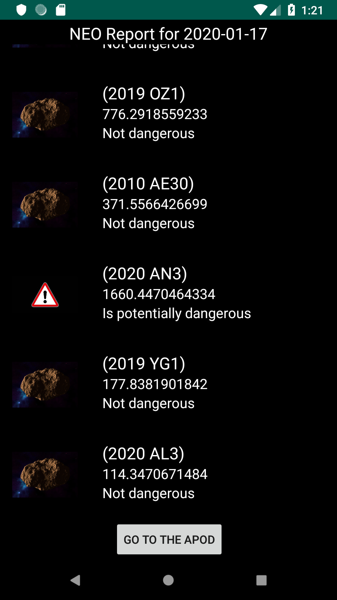
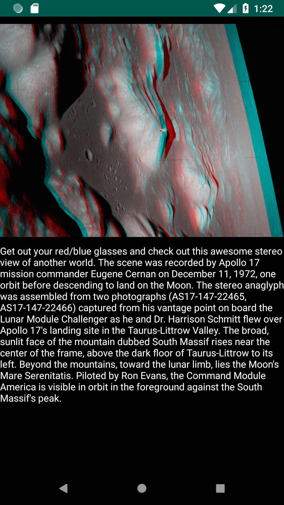

## Asteroids-Android-App
## Synopsis

Have you ever wondered what is floating above our heads? No I'm not talking about birds, planes or Superman. I'm talking about comets, meteorites
and other space debris. This app tells you what objects are near Earth today and it also tells you whether the object is hazardous or not.
So get out your telescopes, open this app and see how many objects you can find. 

## Code

This project relies heavily on NASA's NEO(near earth objects) API, as all the information for this project is extracted from there. It also uses 
NASA's APOD( astronomy picture of the day) API to show the user what the picture of the day is.
Being an android project, the functions of this project were developed using Java.  

## App Walkthrough

### 1) Main Screen

This is the main screen of the app. Here we can see the name of the object, its diameter in meters, and its hazard level. The asteroid icon changes to a caution icon if the object is potentially hazardous. An object is considered hazardous if its miss distance from earth is relatively small. 

### 2) Astronomy Picture of The Day (APOD) Screen

This screen shows NASA's astronomy picture of the day as well as the description accompanying the picture. Looking at NASA's picture of the day can be a great source of inspiration for the budding astronomy photographer.  
